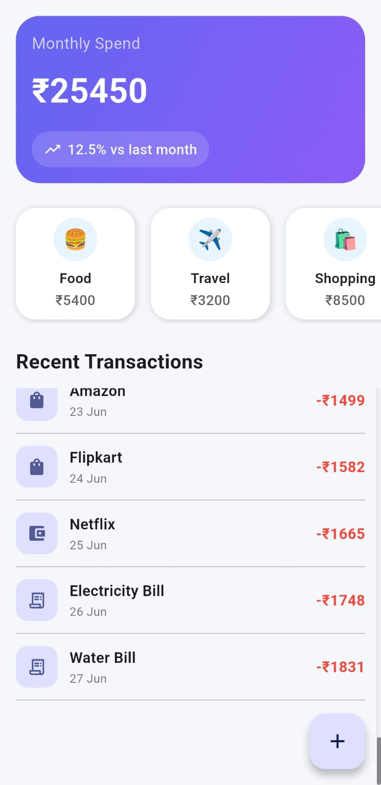
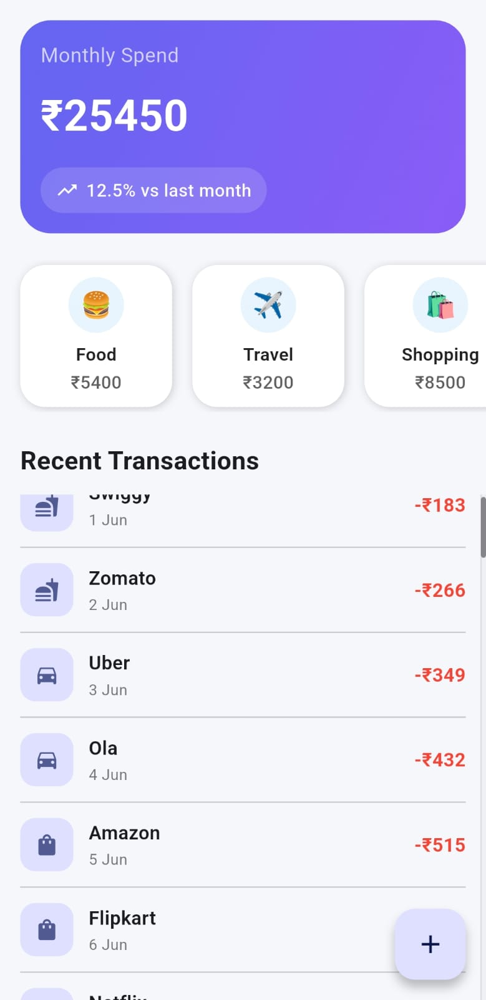
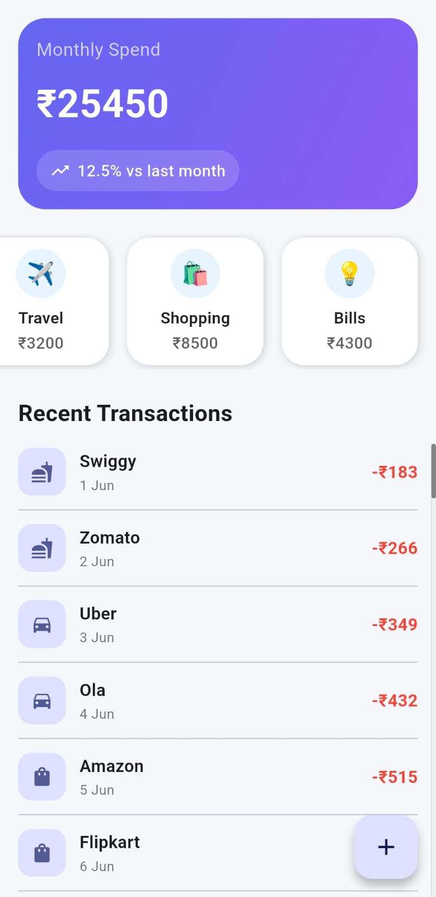

# infinity_consultants_assignment
# Spend Summary App

A Flutter application that displays:

* Monthly spend summary with percentage change
* Category-wise spending overview
* Recent transactions list
* Floating Action Button (FAB)

## Architecture

The application follows:

* Clean Architecture
* MVVM Pattern
* Riverpod for State Management
* SOLID Principles

### Project Structure

* Data Layer

  * Data Sources
  * Repository Implementations

* Domain Layer

  * Entities
  * Repository Contracts
  * Use Cases

* Presentation Layer

  * Views
  * ViewModels
  * Riverpod Providers
  * Reusable Widgets

## Features

* Spend Summary Header Card
* Horizontal Category Scroller
* Scrollable Recent Transactions List
* Responsive UI
* Material 3 Design
* Portrait Mode Support

## Screenshots

## AI Tools Used

### GitHub Copilot

Used for:

* Code completion
* Widget scaffolding
* Reducing repetitive coding effort

### ChatGPT

Used for:

* Architecture planning
* Clean Architecture and MVVM structure guidance
* Riverpod implementation suggestions
* UI/UX improvement ideas
* Code review and optimization discussions

All generated suggestions were reviewed, modified, and integrated manually during development.

